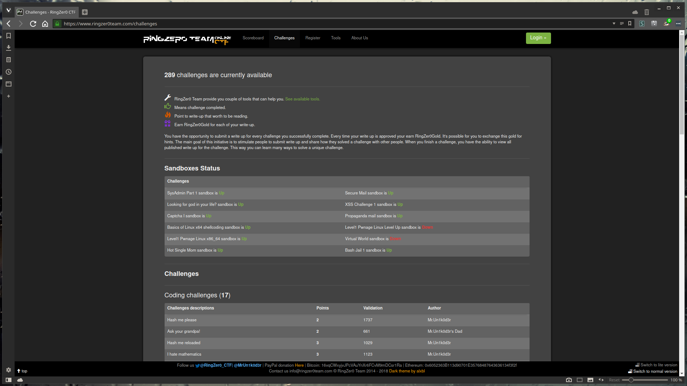
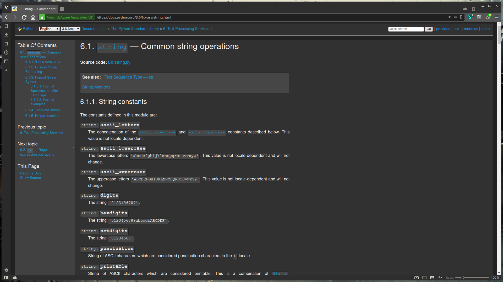

Stylus: Style Collection
========================

Custom stylesheets for various websites that I use often. Mostly dark themes
that work well at night with minor or no layout changes.

Currently included are:
- https://ringzer0team.com
- https://docs.python.org

Where syntax highlighting is required, I like to use [dracula][1]. It has an
awesome retrofuture feel to it and it's nice on the eyes.

[1]: https://draculatheme.com/

## Build

    npm install
    npm run build

The CSS files will go to `dist/`

For convenience, the latest build is checked-in.

## Development

    npm install
    npm start

Then create a stylus theme with `@import "http://localhost:3000/dist/<your-stylesheet>.css";`

Refresh the page every time you make a change. `node-sass` is flakey and might
require a restart from time to time.

## Screenshots

### RingZer0Team CTF

### PyDocs

